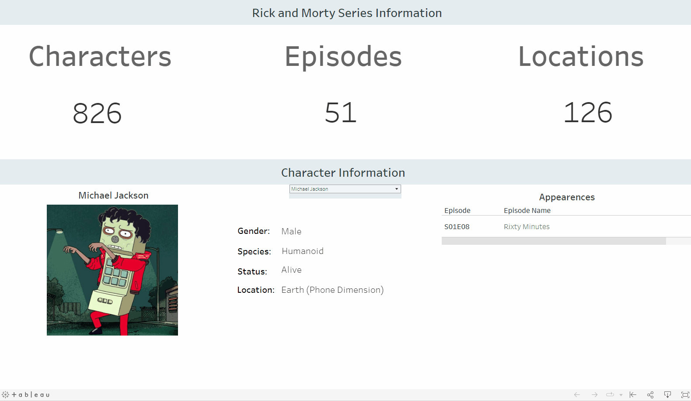
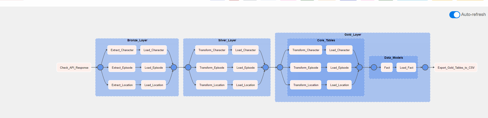
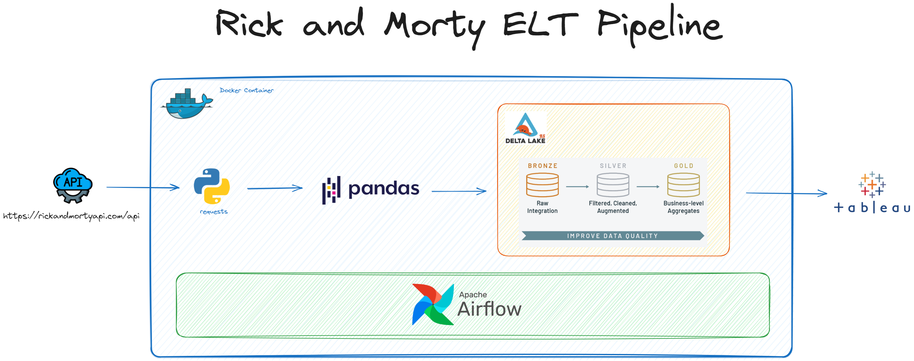

<h1 align="center"> </h1>

<h1 align="center" style="color:#40A7FF;font-size:28px"><b>Rick and Morty ELT Pipeline</b></h1>

<p align="center">
  


<p align="center">
  <a href="#about">About</a> •
  <a href="#installation">Installation</a> •
  <a href="https://public.tableau.com/app/profile/jared.grove/viz/RickandMorty_16915108970840/Dashboard1">Dashboard</a> •
  <a href="#elt_diagram">ELT Diagram</a> •
  <a href="#improvements">Improvements</a> 
</p>

<p align="center">
</a>  
</p>

<p align="center">
</a>  
</p>

<h2 id="about">About</h2>

In this data engineering project, my main goal was to build a data pipeline to extract, transform, and load data from the <a href="https://rickandmortyapi.com/api">Rick and Morty API</a>. I aimed to create an organized and efficient flow of data using a combination of tools and technologies.

To start, I utilized the Python requests package to fetch data from the <a href="https://rickandmortyapi.com/api">Rick and Morty API</a>. This marked the beginning of the data extraction process, where I collected information about characters, episodes, and locations.

For data storage, I took a modern approach by implementing a Delta Lake using the delta-rs package along with the Medallion architecture. This cutting-edge tool allowed me to manage structured and semi-structured data effectively without relying on Apache Spark. The result was a lightweight, yet powerful storage solution for anything less then big data. 

In the transformation phase, I turned to the pandas library. This step involved shaping the extracted data into a more manageable format. Through a series of data cleaning, filtering, and structuring operations, I harnessed the flexibility of pandas DataFrames.

Apache Airflow, played a role in orchestrating the entire process. Airflow enabled me to schedule and automate data extraction, transformation, and loading.

Using Docker, I containerized the project. This step allowed me to encapsulate the entire workflow and its dependencies, making it easily portable across different environments. Containerization ensured consistency and eliminated potential compatibility issues, making deployment a breeze.

In essence, this project showcases my ability to seamlessly gather, store, transform, and orchestrate data using a well-chosen set of tools. From extracting data through APIs to utilizing advanced storage techniques, employing data transformation libraries, orchestrating tasks with Airflow, and finally containerizing the project, every step reflects a strategic approach to building a robust and efficient data pipeline, even if only on a small scale.

<h3 id="elt_diagram">ELT Diagram</h2>
<h1 align="center"></h1>

<h3>Key Technologies:</h3>

<ul>
  <li>Python</li>
  <li>Apache Airflow</li>
  <li>Delta-rs: Data storage layer with ACID transactions and versioning</li>
  <li>Docker: Containerization platform for easy deployment and reproducibility</li>
  <li>Tableau: Visual analytics platform</li>
</ul>

<h3>Application services at runtime:</h3>

<ul>
  <li>One airflow worker</li>
  <li>One airflow scheduler</li>
  <li>One airflow triggerer</li>
  <li>One airflow webserver</li>
  <li>Redis</li>
  <li>Postgres</li>
</ul>

<h2 id="installation">Installation</h2>

1. Download [Docker Desktop](https://www.docker.com/products/docker-desktop/) and start docker
2. Clone Repo 
```bash
git clone https://github.com/jgrove90/rick-and-morty-deltalake.git
```
3. Run `start.sh` 
```bash
sh start.sh
```
4. Access application services via the web browser:
    
    * Airflow UI - `http://localhost:8080/`

5. Run `teardown.sh` to remove application from system including docker images
```bash
sh teardown.sh
```

<h2 id="improvements">Improvements</h2>

Data validation can be done prior to loading the delta tables at each layer of the pipeline. This data was very clean and only needed to perform simple transformations. As a proof of concept I might return to this project and include a framework like:
<ul>
  <li><a href="https://greatexpectations.io/gx-oss">Great Expectations</a></li>
  <li><a href="https://docs.soda.io/soda-core/overview-main.html">Soda Core</a></li>
  <li><a href="https://pandera.readthedocs.io/en/stable/">Pandera</a></li>
</ul>

I'd probably go with Soda Core or Pandera as they are lightweight frameworks compared to Great Expectations.


Finally, a more indepth statistical analysis could be performed using: 

<ul>
  <li>Jupyter Lab</li>
  <li>Dashboards (might revisit this and make it more visually appealing)</li>
</ul>
</p>